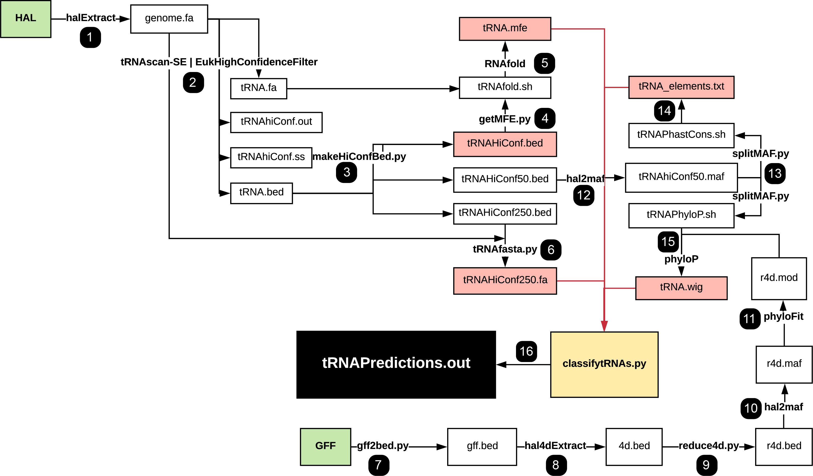

# tRNA gene classifier

This program uses DNA data alone to predict tRNA gene expression, using binary (active/inactive) classifications. The premise of this project was based heavily on the observations made in this study: https://www.pnas.org/content/pnas/early/2018/08/17/1801240115.full.pdf. A separate manuscript focused on the development of this classifier will be posted on bioRxiv very soon.

This program was built with a focus on going from a HAL object to tRNA classifications. However, many labs use MAFs instead of HALs, or may have already reduced their HALs to other forms. To handle this, the pipeline has many files to be used in the order given, but any step can be skipped if you already have the file that that step produces.

By the time you are ready to run the script that makes the actual classifications, you should have:
- .wig file with PhyloP scores for all bases spanning from 20 bases upstream to 10 bases downstream of each tRNA gene
- .bed file showing the coordinates of each tRNA gene (from tRNAscan-SE)
- .out file containing the bit-scores of each tRNA gene (from tRNAscan-SE)
- .fa file with DNA sequence spanning from 250 bases upstream to 250 bases downstream of each tRNA gene (or to the end of the chromosome/scaffold)
- RNAfold output showing the minimum free energy for each tRNA gene
- .bed file containing the locations of annotated protein coding genes in your genome of interest

To run from start to finish, the dependencies are scikit-learn, RNAfold, tRNAscan-SE, HAL and PHAST. These instructions for HAL and PHAST are thorough and should work for most systems: https://github.com/ComparativeGenomicsToolkit/hal

You can download tRNAscan-SE at http://lowelab.ucsc.edu/tRNAscan-SE/. You can also download the necessary data directly from http://gtrnadb.ucsc.edu. You can download RNAfold here: https://github.com/ViennaRNA/ViennaRNA. scikit-learn can be downloaded using `conda install scikit-learn` or `pip install scikit-learn`.

### Table of Contents

- [Graphical Overview](#overview)
- [Step-by-step Guide](#guide)
- [What's in this repository](#what)

### Graphical Overview:

Here is a general guide to the program in the listed order. All commands ending in .py are custom programs that can be found in this repository. The rest are either functions of HAL, PHAST or tRNAscan-SE:

### Step-by-step Guide:

##### 1: extract genome from HAL alignment
`hal2fasta /path/to/hal-file species-name > genome.fa`
##### 2: use tRNAscan-SE 2.0 to find and annotate tRNA genes, and filter out pseudogenes and low-confidence genes
`tRNAscan-SE genome.fa -o tRNA.out -f tRNA.ss -s tRNA.iso -m tRNA.stats -b tRNA.bed -a tRNA.fa -H -y --detail`
`EukHighConfidenceFilter -r -i tRNA.out -s tRNA.ss -p tRNA_hiConf -o /path/to/desired/output/`
##### 3: use python script to make a bed file containing only high-confidence tRNA genes with 0-, 50-, and 250-base flanking regions (recommended: include file with chromosome lengths)
`python makeHiConfBed.py tRNA_hiConf.out tRNA.bed (chromosome_lengths.txt)`
##### 4: create an input file to be analyzed by RNAfold:
`python getMFE.py tRNA_hiConf.ss tRNA_hiConf.bed`
##### 5: run RNAfold to determine MFE for each tRNA gene:
`chmod u+x tRNAfold.sh`
`./tRNAfold.sh`
##### 6: create a .fa file containing the tRNA gene and its 250 flanks on either side:
`python tRNAFasta.py tRNA_hiConf_250.bed genome.fa`

##### 7: convert .gff annotation file to .bed:
##### 8: find four-fold degenerate sites to be used as neutral regions to train PhyloP model:
##### 9: (optional, recommended for large genomes) subsample down to the 4d sites of 100,000 exons to speed up PhyloP training process:
##### 10: convert 4d .bed file to .maf format:
##### 11: use PhyloFit to train model and produce .mod file:

##### 12: convert tRNA genes and 50-base flanking regions to .maf format:
##### 13: split .maf by chromosome for handling by PhyloP and create phastCons and PhyloP command files:
##### 14: run phastCons to find tRNAs with extended conserved flanking regions:
##### 15: run PhyloP to produce .wig file encompassing all tRNAs and flanking regions:

##### 16: use data generated in previous steps to classify each tRNA as active or inactive:

### What's in this repository:
- makeHiConfBed.py -- creates 3 .bed files of high-confidence tRNA genes, with 0-, 50- and 250-base padding on either side
- getMFE.py -- uses tRNAscan-SE secondary structure file and converts to a form usable by RNAfold. Also produces bash script `tRNAfold.sh` that will call RNAfold on this same file.
- tRNAFasta.py -- takes in a bed file and genome-wide .fa file and outputs the sequence in .fa format corresponding to the bed file.
- gff2bed.py -- converts .gff file to .bed format.
- reduce4d.py -- converts bed file output by hal4dExtract to a bed containing only the 4d sites of 100,000 randomly distributed exons.
- splitMAF.py -- splits genome-wide .maf into separate files by chromosome. Also creates bash scripts `tRNAPhastCons.sh` and `tRNAPhyloP.sh` to be called to get phastCons elements and PhyloP scores for tRNA loci, respectively.
- humanTrainingData.tsv -- tRNA data derived from these methods performed on the hg38 genome.
- humanTrainingLabels.tsv -- active and inactive states for each tRNA derived from epigenomic data.
- classifytRNAs.py -- gathers PhyloP scores, tRNAscan-SE bit scores, MFE, CpG content, distance to protein-coding genes for each tRNA gene, and uses analogous data and labels from human data to predict activity states for each tRNA in the genome of interest. Outputs tRNAPredictions.out, which contains the name of each tRNA, its predicted activity, and the probability scores as determined by sklearn.

