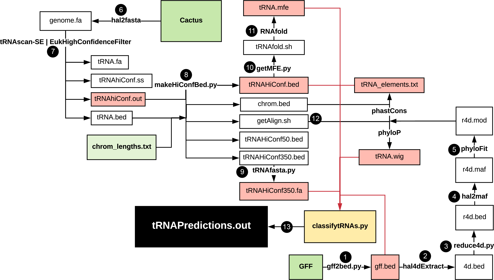
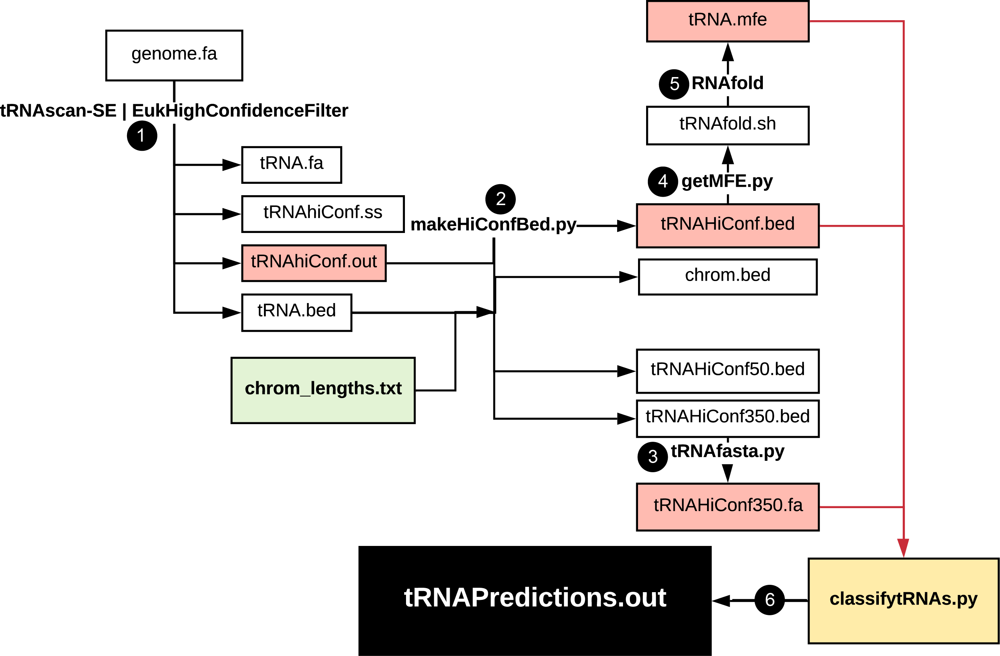

# tRAP (tRNA Acitivity Predictor)

This program uses DNA data alone to predict tRNA gene expression, using binary (active/inactive) classifications. For the corresponding manuscript, see https://genome.cshlp.org/content/30/1/85.

This program was built with a focus on going from a HAL object to tRNA classifications. However, many labs use MAFs instead of HALs, or may have already reduced their HALs to other forms. To handle this, the pipeline has many files to be used in the order given, but any step can be skipped if you already have the file that that step produces.

By the time you are ready to run the script that makes the actual classifications, you should have:
- .wig file with PhyloP scores for all bases spanning from 20 bases upstream to 10 bases downstream of each tRNA gene
- .bed file showing the coordinates of each tRNA gene (from tRNAscan-SE)
- .out file containing the bit-scores of each tRNA gene (from tRNAscan-SE)
- .fa file with DNA sequence spanning from 350 bases upstream to 350 bases downstream of each tRNA gene (or to the end of the chromosome/scaffold)
- RNAfold output showing the minimum free energy for each tRNA gene
- .bed file containing the locations of annotated protein coding genes in your genome of interest

To run from start to finish, the dependencies are scikit-learn, RNAfold, tRNAscan-SE, HAL and PHAST. These instructions for HAL and PHAST are thorough and should work for most systems: https://github.com/ComparativeGenomicsToolkit/hal

You can download tRNAscan-SE at http://lowelab.ucsc.edu/tRNAscan-SE/. You can also download the necessary data directly from http://gtrnadb.ucsc.edu. You can download RNAfold here: https://github.com/ViennaRNA/ViennaRNA. scikit-learn can be installed using `conda install scikit-learn` or `pip install scikit-learn`.

### Table of Contents

- [General Usage](#general)
- [Graphical Overview](#overview)
- [Step-by-step Guide](#guide)
- [Simplified Version](#simplified)
- [What's in this repository](#what)
- [Contact](#contact)

### General Usage:

Until Cactus becomes more widespread, I anticipate that most people reading this will want a quick classification using only a genome sequence. This is nearly as accurate as the full Cactus-based version, much simpler, faster, and robust. To accomodate this, I've added a Snakefile (for information on Snakemake, see <a href="https://snakemake.readthedocs.io/en/stable/tutorial/tutorial.html">here</a>). To use the Snakefile, first ensure that you've run tRNAscan-SE and EukHighConfidenceFilter on your data (or downloaded these results from gtrnadb.ucsc.edu), and ensure that in your working directory, you have the following files, named in the following way:

##### {root_name}.fa (whole genome sequence in FASTA format)
##### {root_name}.chrom.sizes (downloadable for most species from https://hgdownload.soe.ucsc.edu/goldenPath/)
##### {root_name}-tRNAs.bed (output by tRNAscan-SE)
##### {root_name}-tRNAs-confidence-set.out (output by tRNAscan-SE)
##### {root_name}-tRNAs-confidence-set.ss (output by tRNAscan-SE)

Then, simply call `snakemake {root_name}tRNAScores.txt`. For more details on this process, see the [Simplified Version](#simplified) section.

### Graphical Overview:

### Step-by-step Guide:

Here is a general guide to the program in the listed order. All commands ending in .py are custom programs that can be found in this repository. The rest are either functions of HAL, PHAST or tRNAscan-SE:

##### 1: extract genome from HAL alignment
`hal2fasta /path/to/hal-file species-name > genome.fa`
##### 2: use tRNAscan-SE 2.0 to find and annotate tRNA genes, and filter out pseudogenes and low-confidence genes
`tRNAscan-SE genome.fa -o tRNA.out -f tRNA.ss -s tRNA.iso -m tRNA.stats -b tRNA.bed -a tRNA.fa -H -y --detail`
`EukHighConfidenceFilter -r -i tRNA.out -s tRNA.ss -p tRNA_hiConf -o /out/path/filename`
##### 3: create .bed files of high-confidence tRNAs, .fa of tRNA genes and flanking regions, and shell script to create and analyze data:
`python makeHiConfBed.py -i tRNA_hiConf.out -b tRNA.bed -s species-name -c /path/to/cactus/graph -m /mod/file/from/step-5 (-l chromosome_lengths.txt) -o /out/path/filename`

##### 4: convert .gff annotation file to .bed:
`python gff2bed.py -i annotation.gff -o /out/path/filename`
##### 5: find four-fold degenerate sites to be used as neutral regions to train PhyloP model:
`hal4dExtract /path/to/hal-file species-name annotation.bed /out/path/filename`
##### 6: (optional, recommended for large genomes) subsample down to the 4d sites of 100,000 exons to speed up PhyloP training process:
`python reduce4d.py -i 4d.bed -n num-exons-to-keep -o /out/path/filename`
##### 7: convert 4d .bed file to .maf format:
`hal2mafMP.py --numProc 10 --refGenome species-name --refTargets 4dreduced.bed /path/to/hal-file /out/path/filename`
`cat /out/path/filename-from-previous-step* > 4dreduced.maf`
##### 8: use PhyloFit to train model and produce .mod file:
`phyloFit -eM --tree newick-tree-from-hal-file --msa-format MAF --precision MED --subst-mod REV --out-root /out/path/filename 4dreduced.maf`

##### 9: create a .fa file containing the tRNA gene and its 350 flanks on either side:
`python tRNAFasta.py -b tRNA_hiConf_350.bed -g genome.fa -o /out/path/filename`
##### 10: create an input file to be analyzed by RNAfold:
`python getMFE.py -s tRNA_hiConf.ss -b tRNA_hiConf.bed -o /out/path/filename`
##### 11: run RNAfold to determine MFE for each tRNA gene:
`RNAfold --noPS -C < /out/from/step-10.txt > tRNA.mfe`

##### 12: run hal2maf, phyloP and phastCons to get data for classification:
`./species-name-getAlign.sh (generated in step 8)`

##### 13: classify tRNA genes using data created earlier in the pipeline and human training data:
`python classifytRNAs.py -b tRNA_hiConf.bed -e tRNA_hiConf_350.bed -c phastConsElements.txt -w tRNA.wig -t tRNA_hiConf.out -m tRNA.mfe -f tRNA_hiConf_350.fa -g gff.bed -l chrom_lengths.txt -d humanTrainingData.tsv -o /out/path/tRNAClassifications.out`

### Simplified Version:

You might be wondering what to do if you have no Cactus graph, or annotation for your tRNA gene set of interest. To handle this case, we have introduced a simplified version of the pipeline. Here, you would just do steps 2, 3, 9, 10, 11 and 13 from above. For simplicity, this version is outlined below:

##### 1: use tRNAscan-SE 2.0 to find and annotate tRNA genes, and filter out pseudogenes and low-confidence genes
`tRNAscan-SE genome.fa -o tRNA.out -f tRNA.ss -s tRNA.iso -m tRNA.stats -b tRNA.bed -a tRNA.fa -H -y --detail`
`EukHighConfidenceFilter -r -i tRNA.out -s tRNA.ss -p tRNA_hiConf -o /out/path/filename`
##### 2: create .bed files of high-confidence tRNAs, .fa of tRNA genes and flanking regions, and shell script to create and analyze data:
`python makeHiConfBed.py -i tRNA_hiConf.out -b tRNA.bed (-l chromosome_lengths.txt) -o /out/path/filename`

##### 3: create a .fa file containing the tRNA gene and its 350 flanks on either side:
`python tRNAFasta.py -b tRNA_hiConf_350.bed -g genome.fa -o /out/path/filename`
##### 4: create an input file to be analyzed by RNAfold:
`python getMFE.py -s tRNA_hiConf.ss -b tRNA_hiConf.bed -o /out/path/filename`
##### 5: run RNAfold to determine MFE for each tRNA gene:
`RNAfold --noPS -C < /out/from/step-4.txt > tRNA.mfe`

##### 6: classify tRNA genes using simplified flag (-x) and alternate training data set.:
`python classifytRNAs.py -b tRNA_hiConf.bed -e tRNA_hiConf_350.bed -t tRNA_hiConf.out -m tRNA.mfe -f tRNA_hiConf_350.fa -l chrom_lengths.txt -d humanSimplifiedTrainingData.tsv -o /out/path/tRNAClassifications.out -x True`

### What's in this repository:
- `makeHiConfBed.py` -- creates 3 .bed files of high-confidence tRNA genes, with 0-, 50- and 350-base padding on either side, and a shell script that will convert these to MAFs and then to PhyloP scores and PhastCons elements
- `getMFE.py` -- uses tRNAscan-SE secondary structure file and converts to a form usable by RNAfold. Also produces bash script `tRNAfold.sh` that will call RNAfold on this same file.
- `tRNAFasta.py` -- takes in a bed file and genome-wide .fa file and outputs the sequence in .fa format corresponding to the bed file.
- `gff2bed.py` -- converts .gff file to .bed format containing only exons.
- `sortBeds.py` -- ensures that all .bed files are sorted, as hal2maf will ignore all out-of-order lines.
- `reduce4d.py` -- converts .bed file output by hal4dExtract to a .bed containing only the 4d sites of 100,000 randomly distributed exons.
- `humanTrainingData.tsv` -- tRNA data derived from these methods performed on the hg38 genome.
- `humanSimplifiedTrainingData.tsv` -- tRNA data derived from the simplified methods performed on the hg38 genome.
- `classifytRNAs.py` -- gathers PhyloP scores, tRNAscan-SE bit scores, MFE, CpG content, distance to protein-coding genes for each tRNA gene, and uses analogous data and labels from human data to predict activity states for each tRNA in the genome of interest. Outputs tRNAPredictions.out, which contains the name of each tRNA, its predicted activity, and the probability scores as determined by sklearn.

### Contact:

Please direct all questions to bthornlo@ucsc.edu.
